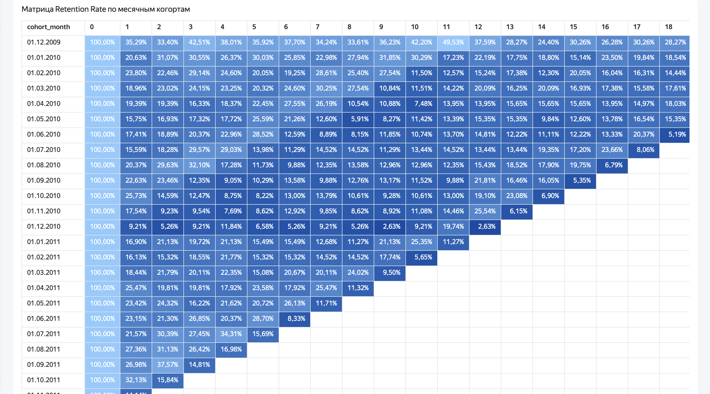

# online-retail-cohort-analysis
Когортный анализ и расчет Retention Rate на стеке ClickHouse + Yandex DataLens
markdown# Когортный анализ и расчет Retention Rate для Online Retail

Проект посвящен анализу повторных продаж и лояльности клиентов на основе исторических транзакций интернет-магазина.

## 🛠 Стек технологий
* **База данных:** ClickHouse Cloud (SQL: CTE, агрегатные функции, обработка дат)
* **BI-платформа:** Yandex DataLens

## 📊 Ссылки на проект
* **Интерактивный дашборд:** [Смотреть в DataLens](https://datalens.yandex/j3b7rnmnyz6c2)

## 📌 Главные выводы:

1. **«Золотая когорта» (Декабрь 2009):** Клиенты, пришедшие в самый первый месяц, показывают аномально высокое удержание на протяжении всего года (стабильно >33% возвратов). Рекомендуется изучить маркетинговые активности того периода для масштабирования успеха. 

2. **Критический провал (Декабрь 2010):** Удержание клиентов, пришедших в декабре 2010 года, резко рухнуло уже на первом месяце жизни до 9,21% (в сравнении с 20-35% у других когорт). Это указывает на системный сбой: логистические трудности перед праздниками, привлечение нецелевого трафика или технические ошибки на сайте. 

3. **Общий тренд угасания:** В среднем бизнес удерживает около 15-20% клиентов к третьему месяцу жизни когорты, после чего метрика стабилизируется.

## 📈 Визуализация матрицы когорт


## 💻 Логика расчетов
Вся предобработка данных выполнена на стороне ClickHouse. Из сырого датасета `online_retail_ll` были отфильтрованы возвраты товаров (строки с отрицательной ценой и количеством), выделены даты первой покупки пользователей и рассчитаны интервалы активности. Полный скрипт доступен в файле `query.sql`.

Финальный расчет бизнес-метрики **Retention Rate** реализован в интерфейсе DataLens на лету с использованием условного выражения `FIXED`:
```formula
SUM([countDistinct(Customer ID)]) / SUM(IF [month_number] = 0 THEN [countDistinct(Customer ID)] ELSE 0 END FIXED [cohort_month])
```
Это позволило сохранить интерактивность дашборда и корректность расчетов 
